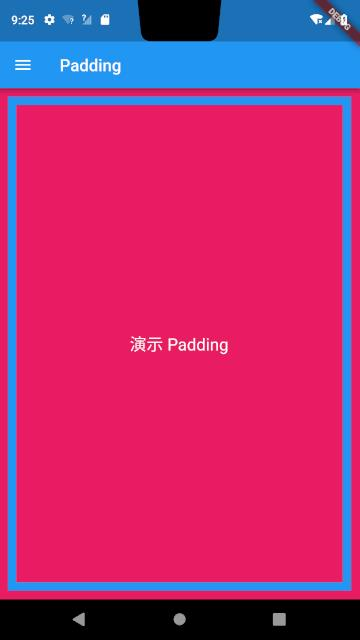

## Padding
> Padding可以给其子节点添加补白（填充）
### 定义
```dart
Padding({
  ...
  EdgeInsetsGeometry padding,
  Widget child,
})
```
EdgeInsetsGeometry是一个抽象类，开发中，我们一般都使用EdgeInsets，它是EdgeInsetsGeometry的一个子类，定义了一些设置补白的便捷方法。
###  EdgeInsets
我们看看EdgeInsets提供的便捷方法：

- fromLTRB(double left, double top, double right, double bottom)：分别指定四个方向的补白。
- all(double value) : 所有方向均使用相同数值的补白。
- only({left, top, right ,bottom })：可以设置具体某个方向的补白(可以同时指定多个方向)。
- symmetric({ vertical, horizontal })：用于设置对称方向的补白，vertical指top和bottom，horizontal指left和right。
- 
### 示例
```dart
Container(
  color: Colors.pink,
  child: Padding(
    padding: const EdgeInsets.all(10.0),
    child: Container(
      color: Colors.blue,
      child: Padding(
        padding: const EdgeInsets.all(10.0),
        child: Container(
          color: Colors.pink,
          alignment: Alignment.center,
          child: Text(
            "演示 Padding",
            style: TextStyle(
              color: Colors.white,
              fontSize: 20.0,
            ),
          ),
        ),
      ),
    ),
  ),
);
```


## Align
> Align本身实现的功能并不复杂，设置child的对齐方式，例如居中、居左居右等，并根据child尺寸调节自身尺寸。

Align的布局行为分为两种情况：

1. 当widthFactor和heightFactor为null的时候，当其有限制条件的时候，Align会根据限制条件尽量的扩展自己的尺寸，当没有限制条件的时候，会调整到child的尺寸；
2. 当widthFactor或者heightFactor不为null的时候，Aligin会根据factor属性，扩展自己的尺寸，例如设置widthFactor为2.0的时候，那么，Align的宽度将会是child的两倍。

Align为什么会有这样的布局行为呢？原因很简单，设置对齐方式的话，如果外层元素尺寸不确定的话，内部的对齐就无法确定。因此，会有宽高因子、根据外层限制扩大到最大尺寸、外层不确定时调整到child尺寸这些行为。

## Center
> Center继承自Align，只不过是将alignment设置为Alignment.center，其他属性例如widthFactor、heightFactor，布局行为，都与Align完全一样。