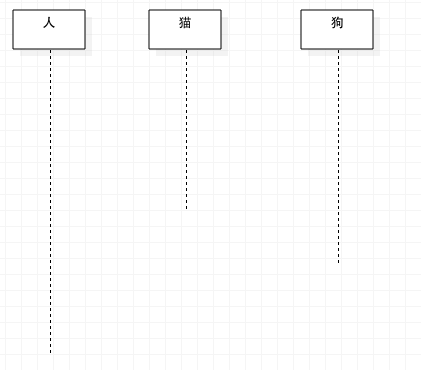
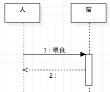
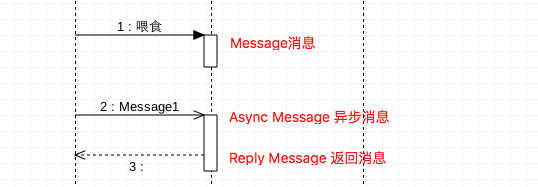
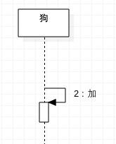

### 时序图（Sequence Diagram）
#### 简介
>时序图（Sequence Diagram）是显示对象之间交互的图，这些对象是按时间顺序排列的。顺序图中显示的是参与交互的对象及其对象之间消息交互的顺序。时序图中包括的建模元素主要有：对象（Actor）、生命线（Lifeline）、控制焦点（Focus of control）、消息（Message）等等。

#### 时序图元素（Sequence Diagram Elements）
- 角色（Actor）
>系统角色，可以是人、及其甚至其他的系统或者子系统。

- 对象（Object）
>对象包括三种命名方式：
  - 第一种方式包括对象名和类名；
  - 第二中方式只显示类名不显示对象名，即表示他是一个匿名对象；
  - 第三种方式只显示对象名不显示类明。

- 生命线（Lifeline）
>生命线在顺序图中表示为从对象图标向下延伸的一条虚线，表示对象存在的时间，如下图 

-  控制焦点（Focus of Control）
>控制焦点是顺序图中表示时间段的符号，在这个时间段内对象将执行相应的操作。用小矩形表示，如下图。 

-  消息（Message）
>消息一般分为
  - 同步消息（Synchronous Message） 
  消息的发送者把控制传递给消息的接收者，然后停止活动，等待消息的接收者放弃或者返回控制。用来表示同步的意义。
  - 异步消息（Asynchronous Message） 
  消息发送者通过消息把信号传递给消息的接收者，然后继续自己的活动，不等待接受者返回消息或者控制。异步消息的接收者和发送者是并发工作的。
  - 返回消息（Return Message） 
  返回消息表示从过程调用返回 

- 自关联消息（Self-Message）
>示方法的自身调用以及一个对象内的一个方法调用另外一个方法。 

